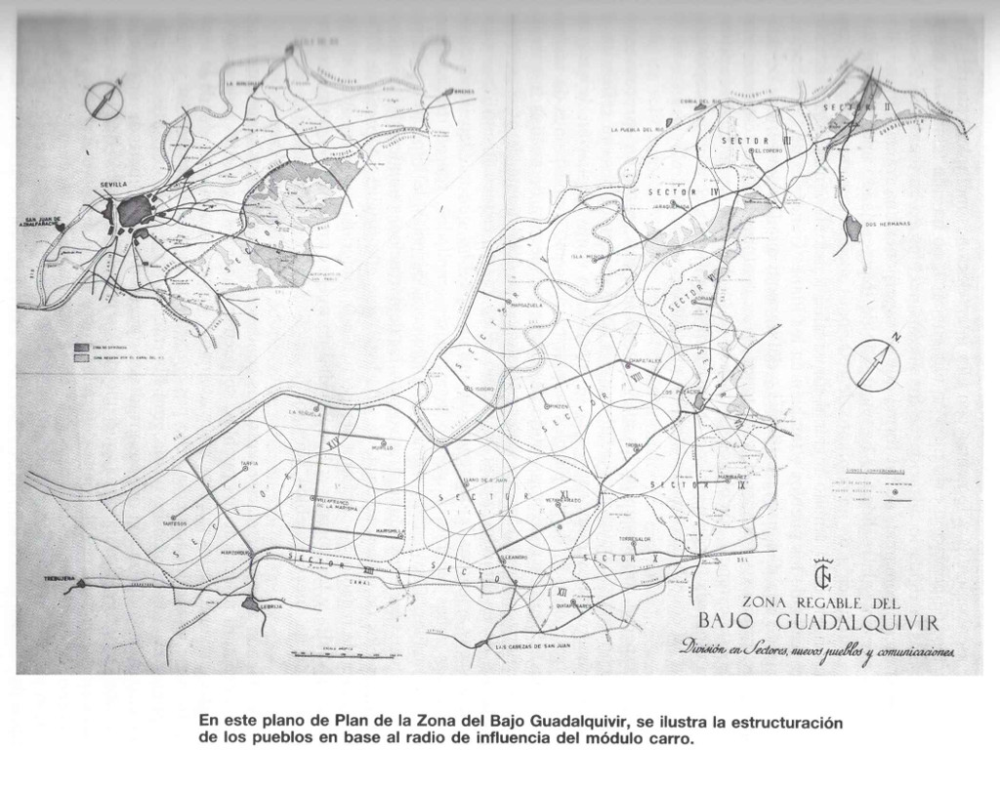

Donde no hay nada puede construirse todo. Eso debieron pensar los principales arquitectos españoles que acudieron a diseñar los nuevos poblados de colonización con la idea de convertir esos lugares en laboratorios vanguardistas. Algunos de los mejores arquitectos españoles de la época fueron los encargados de diseñar todos los elementos de estas nuevas localidades, y dieron rienda suelta a su imaginación, siempre respetando los principios racionalistas del Régimen, y la moda de la época.

En el diseño urbano se centraron en usar los trazados curvos y evitar las calles rectas, intentando dar una idea mayor de comunidad y recogimiento. Adaptaron conceptos organicistas, que eran la vanguardia en los años 40, para convertir estos nuevos poblados en lugares en armonía con el entorno y la naturaleza. La idea principal para estos proyectos era sacar el mayor provecho posible a estos nuevos municipios, teniendo la funcionalidad y la optimización de los recursos como primera premisa.

Durante los años que duraron estos planes de colonización, unos ochenta arquitectos trabajaron en los proyectos. Muchos de ellos de gran fama mundial como Alejandro de la Sota, Carlos Arniches Moltó, José Borobio, José Antonio Corrales, Fernando de Terán o Antonio Fernández Alba, entre muchos otros. Aunque el que dejó las obras más brillantes fue José Luis Fernández del Amo. Él diseñó poblados como Vegaviana (Cáceres) o Cañada de Agra (Albacete) que han quedado para la historia de la arquitectura dentro y fuera de España.

Pero estos conceptos vanguardistas también chocaron con una idea del campo atrasada y la falta progreso de la agricultura. El sector agrario en España en los años 40 adolecía de falta de mecanización y poca inversión. Por eso los poblados se crearon con el concepto del ‘módulo carro’. El agricultor, es decir, el colono, no podía vivir a más de 2,5 km de su tierra de labor ya que debía ir con sus aperos hasta su tierra, trabajar, y después volver a su casa sin perder demasiado tiempo en el camino. Esto pronto quedó desfasado, con el progreso económico se llevó a cabo una modernización y mecanización de la agricultura dejando en desfase este concepto y por tanto el diseño de los poblados.

A día de hoy algunos de estos pueblos se han quedado como joyas de esta arquitectura racionalista, con diseños muy originales y construcciones únicas.

